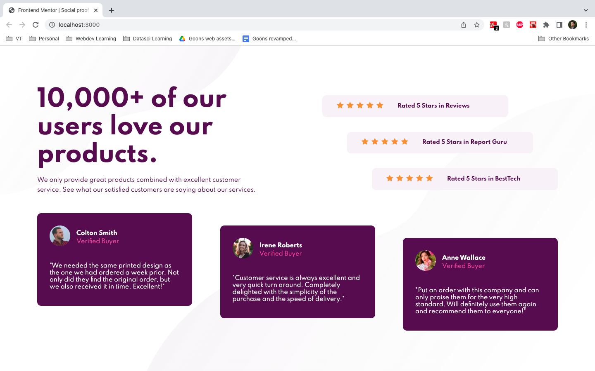

# Frontend Mentor - Social proof section solution

This is a solution to the [Social proof section challenge on Frontend Mentor](https://www.frontendmentor.io/challenges/social-proof-section-6e0qTv_bA). Frontend Mentor challenges help you improve your coding skills by building realistic projects. 

## Table of contents

- [Overview](#overview)
  - [Screenshot](#screenshot)
  - [Links](#links)
- [My process](#my-process)
  - [Built with](#built-with)
  - [What I learned](#what-i-learned)
  - [Continued development](#continued-development)
  - [Useful resources](#useful-resources)
- [Author](#author)

## Overview
### Screenshot

### Links

- Solution URL: [GitHub](https://github.com/wongd-hub/fm-social-proof-section)
- Live Site URL: [Vercel](https://fm-social-proof-section-six.vercel.app)

## My process
### Built with

- JSX
- CSS Flexbox & Grid
- CSS Grid
- [React](https://reactjs.org/) - JS library
- [Next.js](https://nextjs.org/) - React framework
- [Framer Motion](https://www.framer.com/docs/) - Animation library

## Author

- GitHub - [Darren W.](https://github.com/wongd-hub/)
- Frontend Mentor - [@wongd-hub](https://www.frontendmentor.io/profile/wongd-hub)